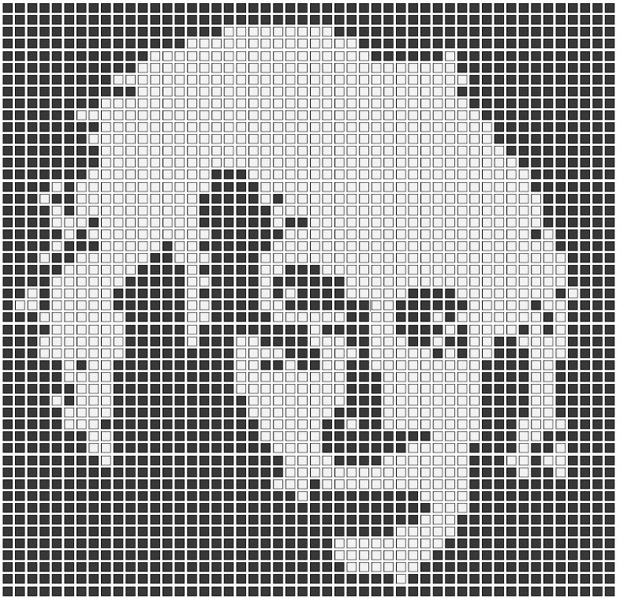

# Nonogram
A nonogram generator and solver， generate hint from image or solve game provided hint, all possible solutions can be found.

### See my [Blog](http://xie_emily.gitee.io/xieemily.github.io) for details.


## How To Run

````
cd out/production/nonogram2
java com.nonogram.Main -**option below**
````


**options:**

- `-s [filepath] [outpath]` 		solve mode, enter board size `row col` and `hint `, solution will be coded as `0` and `1` in out put file.

- `-g [imgpath] [outpath]` 		generate mode, generate hint from image

- `-t [filepath] [outpath]`        test mode, test if game has unique solution, if not, non-deterministic cells will be marked by `?`, and coded `2` in output file.


Output file is optional.

Input file is optional in `-s` and `-t `mode, if input file and output file are not provided, you will be asked to enter hint in command line.

**example:**

This convert `image.jpg` and generate hint to `hint.txt`:

```
java com.nonogram.Main -g /.../image.jpg /.../hint.txt
```

Solve `hint.txt` to `solved.txt`:

```
java com.nonogram.Main -s /.../hint.txt /.../solved.txt
```

Solve hint by enter hint directly:

```
java com.nonogram.Main -s
```


input should be formatted as follows:

first line: `rownum colnum` 

next rownum lines enter hints of row, number should be seperated by space or comma

next colnum lines enter hints of col


## Usage

- ### Generate game from image:

        

  hint will be printed.

- ### Solve game given hint

Board size: 2  2  

Row hint: 

1 1

1 1

Col hint:

1 1

1 1

Solved:


For game with more than 50 solutions, only the first 50 solutions will be generated, this number can be changed by setting `SULUTION_NEED` to the amount you need.


Game of size 100*100 can be solved within 1 second (per solution), as for solving the hint generated from the Einstein picture above, 50 solutions can be found in about 12 seconds (0.2 s per solution).